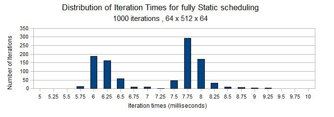

### Motivating Example Code Structure

```C++, caption=Example MPI Application

#include <mpi.h>
int main(int argc, char** argv)
{
  MPI_Init(argc, argv);
  // input
  while (globErr < threshold)
  {
     for (i = 0; i < n; i++)
		loop_body(i);
 MPI_Op(); 
  }
  //output
   MPI_Finalize();	
}

```

\end{frame}


### Motivating Example Code: 2D Laplace

```C++, caption=An Instance of the Pattern

int main(int argc, char** argv)
{
..
  while(locErr > 1000)  {
   MPI_Irecv(leftGhost,gSz,MPI_DOUBLE,id-1,..,&requests[numRequests++]);
   MPI_Isend(leftBoundary,bSz,MPI_DOUBLE,id-1, ..., &requests[numRequests++]);
   MPI_Waitall(numRequests,requests, MPI_STATUSES_IGNORE);
   for (i = 0; i < n; i++) w[i] = (u[i-1] + u[i+1] + u[i])/3.0;
   temp = w; w = u; u = temp;
   MPI_Allreduce();
}

```

\end{frame}


### Motivating Example Code: 2D Laplace with OpenMP

```C++, caption=
#include <mpi.h>
#include <omp.h>

int main(int argc, char** argv)
{
   MPI_Init() 
while (timestep < T ) {
Start; 
#pragma omp parallel for schedule(static, 4) reduce(+:sum) 
     {
       for(i=0; i<n; i++)
      	 sum += a[i]*b[i];
           } 
   Stop;
 MPI_Allreduce(...);
     timestep++;
 }

```

\end{frame}

### 3D Stencil Performance of Code on One Node

%![alt text][histoStatic]

%[histoStatic]: ./plots/IterTimingsHisto-static.png "Spread of Timings of %Outer Iterations of 3D Stencil" 

%

%TODO: figure out how to include the images .

%

\begin{figure}[ht!]
\includegraphics[scale=0.45]{./plots/IterTimingsHisto-static.png}
\caption{\label{fig:iterHisto}  Spread of timings of Outer Iterations of 3D Stencil.} 
\end{figure}

- Note two peaks; long tail (max at 9.5; min at 5.75)
- Note each core has exactly the same work to do*
- Hypothesis: transient "noise" from OS, and hardware variability

\end{frame}


### Transient Load Imbalance and its Potential Mitigation 

\end{frame} 


### Noise Amplification Problem


\end{frame} 


### Within-node Persistent Load Imbalance


\end{frame} 


### Comparison of Inter- and Intra-node Load Imb.


\end{frame} 


\begin{frame}[label=hybridstatdyn]
\frametitle{Hybrid Static/Dynamic Scheduling}
\begin{columns}
  \column{0.5\columnwidth}
  \vspace*{-0.2in}

\lstinputlisting{./listings/threadedCompRegion-static.c}
  \column{0.5\columnwidth}
%  \includegraphics[scale=0.15]{./images/legend-dynamic}\\                                                                                                              
 \vspace*{-0.2in}
  \begin{center}
    \includegraphics[scale=0.31]{images/threadedCompRegion-static}
  \end{center}
  \vspace*{-0.4in}
  \begin{center}
    \tiny Susceptible to imbalance.
  \end{center}
\end{columns}
\begin{columns}
\column{0.5\columnwidth}
\vspace*{-0.15in}
\begin{figure}
\lstinputlisting{./listings/threadedCompRegion-dynamic.c}
\end{figure}
\column{0.5\columnwidth}
  \begin{center}
    \includegraphics[scale=0.31]{images/threadedCompRegion-dynamic}
  \end{center}
\vspace*{-0.3in}
\begin{center}
{\tiny Scheduler overhead stretches time.}
\end{center}
\end{columns}
\begin{columns}
\column{0.5\columnwidth}
%TODO: fix code  to be hybrid sched                                                                                                                                     
\vspace*{-0.1in}
\begin{figure}
\lstinputlisting{./listings/threadedCompRegion-hybrid.c}
\end{figure}
\column{0.5\columnwidth}
\begin{center}
\includegraphics[scale=0.31]{./images/threadedCompRegion-hybrid}
\end{center}
\vspace*{-0.3in}
\begin{center}
{\tiny Can reduce imbalance and sched ovhd. simultaneously.}

%\comments{through \hyperlink{expTunedSF}{tuning} static fraction.}                                                                                                     

\end{center}
\end{columns}

\end{frame}
